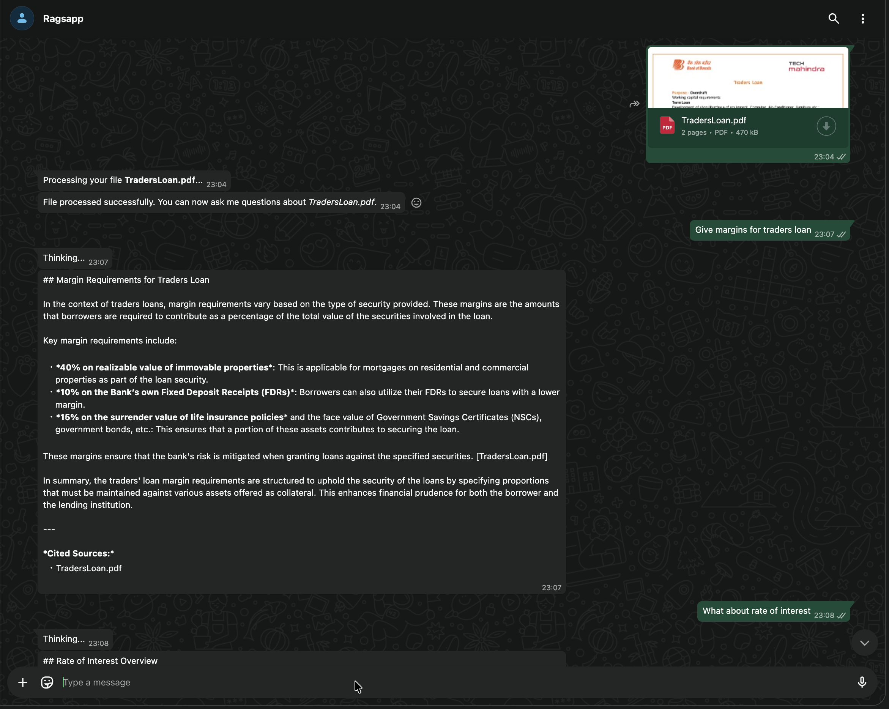
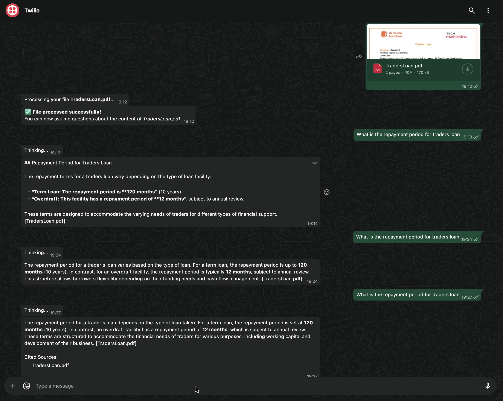

<p align="center">
	
</p>

<p align="center">
  <a href="https://github.com/negativenagesh/RagsApp/stargazers">
    
  </a>
  <a href="https://github.com/negativenagesh/RagsApp/network/members">
    
  </a>
  <a href="https://github.com/negativenagesh/RagsApp/pulls">
    
  </a>
  <a href="https://github.com/negativenagesh/RagsApp/issues">
    
  </a>
  <a href="https://github.com/negativenagesh/RagsApp/blob/main/LICENSE">
    
  </a>
</p>

RagsApp solves a common startup problem: most important updates are shared on WhatsApp first as PDFs, screenshots, invoices, notes, policies, client docs, and voice updates.

But the AI workflow is still broken for daily use. People keep doing this loop:

1. Download from WhatsApp.
1. Open ChatGPT/Gemini/Claude/NotebookLM.
1. Upload file again.
1. Ask questions.
1. Repeat for every new message/document.

That loop kills speed, breaks context, and creates friction for teams that need answers now.

## Demo

### 1. Meta



### 2. Twilio



RagsApp is built to remove that friction with a WhatsApp-native RAG experience:

1. Forward the file or image to RagsApp.
1. Ask your question in the same chat.
1. Get context-grounded answers instantly.
1. Use text or voice notes, whichever is faster.

No extra app-hopping. No repeated download-upload cycle. Just forward and ask where work already happens.

### Example 1: Student Workflow

In a college group, teachers/monitors share notes, PDFs, notices, and screenshots regularly.

Instead of downloading each file and uploading to multiple AI tools every time, students can forward documents directly to RagsApp on WhatsApp and ask:

- "Summarize Unit 3"
- "What are important 10-mark questions?"
- "Where is the assignment deadline mentioned?"

### Example 2: Finance/Accounting/Operations Workflow

Accountants, finance teams, managers, and operations teams receive invoices, statements, policy docs, and reports daily.

Instead of repeatedly downloading and re-uploading those files to external tools, they can forward documents to RagsApp and ask:

- "Give me payment due dates"
- "List all penalties and clauses"
- "Summarize this report for leadership"

### Example 3: Bank Customer Support Workflow

For many users, opening a banking website or navigating app menus for every query is frustrating. WhatsApp is faster and already familiar.

With RagsApp-style support workflows, a customer can:

- Share bank-related documents (policy PDFs, statements, loan terms) and ask questions in WhatsApp.
- Ask direct questions without uploading documents when they only need quick help.

Examples:

- "What is the foreclosure charge in this loan document?"
- "Summarize my credit card statement fees."
- "How can I update my registered mobile number?"
- "What are the current home loan interest rate options?"

### Why This Helps

- Turns WhatsApp into an AI knowledge interface for real team workflows.
- Reduces turnaround time from "find + download + upload" to "forward + ask".
- Keeps context in one place instead of splitting work across multiple tools.
- Useful for students, startup teams, finance/ops roles, and document-heavy collaboration.

### How RagsApp Differs From General WhatsApp AI Bots like Puch AI

Based on publicly visible positioning on [Puch AI](https://puch.ai/) (multi-language chat, fact-checking, image/video generation, stickers, games), the product appears focused on broad assistant and entertainment use cases.

RagsApp is intentionally focused on a different core problem: document-grounded, workflow-centric Q&A inside WhatsApp.

- Instead of generic chat, RagsApp is built for file-driven knowledge retrieval.
- Instead of "download, upload, ask" across multiple tools, users can forward and ask in one WhatsApp thread.
- It supports practical support workflows, including:
  - doc-based Q&A (policies, statements, invoices, notes, reports)
  - question-only support when no document upload is needed

In short: general WhatsApp AI assistants are great for broad conversational help, while RagsApp is optimized for WhatsApp-native RAG on real business and support documents.

## Step-by-Step Setup

1. Star the repo

- https://github.com/negativenagesh/RagsApp

1. Fork the repo

- https://github.com/negativenagesh/RagsApp/fork

1. Clone and open project

```sh
git clone https://github.com/negativenagesh/RagsApp.git
cd RagsApp
```

1. Install uv (if not installed)

- https://docs.astral.sh/uv/getting-started/installation/

1. Initialize uv project files (only if needed)

```sh
uv init
```

1. Create and activate virtual environment

```sh
uv venv
source .venv/bin/activate
```

1. Sync dependencies

```sh
uv sync
```

## Service Ports

- RAG service: 8001
- Ingestion service: 8002
- WhatsApp gateway: 8003

## Required Credentials

- OpenAI
  - Required: API key
  - Get: [OpenAI API Keys](https://platform.openai.com/api-keys)

- Elasticsearch Cloud
  - Required: Elasticsearch URL and API key
  - Get: [Elastic Cloud](https://cloud.elastic.co/)

- Twilio WhatsApp (optional mode)
  - Required: `TWILIO_ACCOUNT_SID`, `TWILIO_AUTH_TOKEN`, `TWILIO_PHONE_NUMBER`
  - Get: [Twilio Console](https://console.twilio.com/)
  - Docs: [Twilio WhatsApp Docs](https://www.twilio.com/docs/whatsapp)

- Meta WhatsApp Cloud API (optional mode)
  - Required: `WHATSAPP_META_ACCESS_TOKEN`, `WHATSAPP_META_PHONE_NUMBER_ID`, `WHATSAPP_META_VERIFY_TOKEN`
  - Get: [Meta WhatsApp Docs](https://developers.facebook.com/docs/whatsapp)

## Example .env Files

Root `.env` example:

```env
OPEN_AI_KEY=xxxxxxxxxx
OPENAI_MODEL=gpt-4o-mini-2024-07-18
OPENAI_SUMMARY_MODEL=gpt-4.1-nano-2025-04-14
OPENAI_EMBEDDING_MODEL=text-embedding-3-large
OPENAI_EMBEDDING_DIMENSIONS=3072

RAG_UPLOAD_ELASTIC_URL=xxxxxxxxxx
ELASTICSEARCH_API_KEY=xxxxxxxxxx

INGESTION_API_URL=http://localhost:8002/ingest
RAG_API_URL=http://localhost:8001/rag-search

WHATSAPP_PROVIDER=meta
WHATSAPP_META_ACCESS_TOKEN=xxxxxxxxxx
WHATSAPP_META_PHONE_NUMBER_ID=xxxxxxxxxx
WHATSAPP_META_WABA_ID=xxxxxxxxxx
WHATSAPP_META_GRAPH_VERSION=v25.0
WHATSAPP_META_VERIFY_TOKEN=xxxxxxxxxx

TWILIO_ACCOUNT_SID=xxxxxxxxxx
TWILIO_AUTH_TOKEN=xxxxxxxxxx
TWILIO_PHONE_NUMBER=whatsapp:+xxxxxxxxxx
```

`services/whatsapp_gateway/.env` example:

```env
TWILIO_ACCOUNT_SID=xxxxxxxxxx
TWILIO_AUTH_TOKEN=xxxxxxxxxx
TWILIO_PHONE_NUMBER=whatsapp:+xxxxxxxxxx

WHATSAPP_PROVIDER=meta
WHATSAPP_META_ACCESS_TOKEN=xxxxxxxxxx
WHATSAPP_META_PHONE_NUMBER_ID=xxxxxxxxxx
WHATSAPP_META_WABA_ID=xxxxxxxxxx
WHATSAPP_META_GRAPH_VERSION=v25.0
WHATSAPP_META_VERIFY_TOKEN=xxxxxxxxxx

INGESTION_API_URL=http://localhost:8002/ingest
RAG_API_URL=http://localhost:8001/rag-search

SUPERVISOR_ENABLED=true
SUPERVISOR_FAIL_OPEN=true
SUPERVISOR_USE_LLM_ROUTER=true
SUPERVISOR_NONRAG_MODEL=gpt-4o-mini
SUPERVISOR_CONFIDENCE_THRESHOLD=0.65

SUPERVISOR_MEMORY_ENABLED=true
SUPERVISOR_MEMORY_INDEX=ragsapp_conversation_memory
SUPERVISOR_MEMORY_TTL_SECONDS=3600

RETRIEVAL_TOP_K_DEFAULT=6
RETRIEVAL_TOP_K_MIN=2
RETRIEVAL_TOP_K_MAX=20
RAG_SYNC_TIMEOUT_SECONDS=120
RAG_STREAM_TIMEOUT_SECONDS=180
```

Supervisor behavior summary:

1. The gateway routes greetings/date-time/small talk without calling RAG.
1. Document-grounded prompts route to retrieval.
1. Recent repeated queries can be served from conversation memory.
1. If routing confidence is low and `SUPERVISOR_FAIL_OPEN=true`, the gateway falls back to RAG for safety.

## Change WhatsApp Provider

1. Open root `.env` and `services/whatsapp_gateway/.env`.
1. Set `WHATSAPP_PROVIDER` to one of:

- `WHATSAPP_PROVIDER=twilio`
- `WHATSAPP_PROVIDER=meta`

1. Save files.
1. Restart `services/whatsapp_gateway` service.

## Run Locally (uv)

Run each service in a separate terminal.

- RAG service

```sh
cd services/rag_service
uv run --active uvicorn app.main:app --host 0.0.0.0 --port 8001
```

- Ingestion service

```sh
cd services/ingestion_service
uv run --active uvicorn app.main:app --host 0.0.0.0 --port 8002
```

- WhatsApp gateway

```sh
cd services/whatsapp_gateway
uv run --active uvicorn app.main:app --host 0.0.0.0 --port 8003
```

## Run with Docker Compose (single root Dockerfile)

This project has one root Dockerfile that is reused by all services in docker-compose.yml.

Start all services:

```sh
docker compose up --build -d
```

Stop all services:

```sh
docker compose down
```

Check status:

```sh
docker compose ps
```

Check logs:

```sh
docker compose logs -f
```

Health checks:

```sh
curl http://localhost:8001/health
curl http://localhost:8002/health
curl http://localhost:8003/health
```

## ngrok and Webhook Exposure

ngrok is a separate process. It is not started automatically by Dockerfile or docker compose.

Run ngrok in a separate terminal after your services are up:

```sh
ngrok http 8003
```

Copy the HTTPS forwarding URL shown by ngrok and build:

- `https://<your-ngrok-domain>/webhook`

Keep ngrok running while you test.

## Run with Twilio

1. Set `WHATSAPP_PROVIDER=twilio`.
1. Set Twilio credentials in env.
1. Restart `services/whatsapp_gateway` after env changes.

### Twilio Sandbox + Callback URL Setup (Step-by-Step)

1. Open Twilio Console > Messaging > Try it out > WhatsApp Sandbox.
1. In Sandbox settings, find **When a message comes in**.
1. Set webhook URL to:

- `https://<your-ngrok-domain>/webhook`

1. Set method to `HTTP POST`.
1. Click Save.

### Join Twilio Sandbox from WhatsApp

1. In Twilio Sandbox page, copy your join instruction.
1. Send the exact join text to Twilio Sandbox number from your phone:

- `join <your-sandbox-keyword>`

Example: if Twilio shows `join camera-pour`, send exactly that text.

1. Wait for Twilio's confirmation reply that your number is connected.

### Send Message/File in Twilio Mode

1. Open WhatsApp chat with the Twilio Sandbox number.
1. Send a text question like: `Summarize my uploaded document`.
1. Send a file/image/document in the same chat (PDF, DOCX, image, etc.).
1. Ask follow-up questions in the same thread.

## Run with Meta

1. Set `WHATSAPP_PROVIDER=meta`.
1. Set Meta credentials in env.
1. Restart `services/whatsapp_gateway` after env changes.

### Meta Callback URL Setup (Step-by-Step)

1. Open Meta Developers > Your App > WhatsApp > Configuration.
1. Open Webhooks configuration.
1. Set Callback URL to:

- `https://<your-ngrok-domain>/webhook`

1. Set Verify token equal to `WHATSAPP_META_VERIFY_TOKEN` from your env.
1. Click Verify and Save.
1. Subscribe webhook fields:

- `messages`
- `message_status`

### Send Message/File in Meta Mode

1. Open WhatsApp chat with your Meta-connected business number.
1. Send a text question to start a conversation.
1. Send a file/image/document in the same chat.
1. Ask follow-up questions in text (or voice note if enabled in your setup).

## Quick Health Checks

- `http://localhost:8001/health`
- `http://localhost:8002/health`
- `http://localhost:8003/health`
